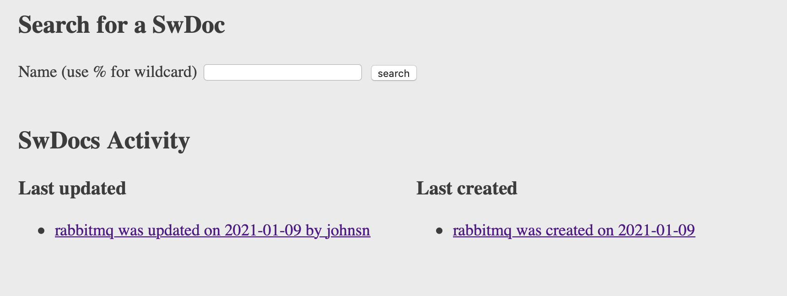
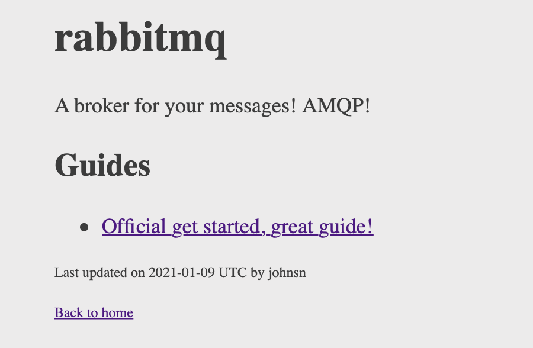

# swdocs
Index all of your software docs easily! 

SwDocs offers a single place with all the relevant links to your software, stop wasting your time trying to find relevant docs across multiple systems:
* Google Drive
* Wikis
* Readthedocs
* Godocs
* Cargo docs
* Github
* Grafana
* Kibana
* Upstream websites
* Prometheus Dashboards
* (...)

Have a one stop shop! By being an indexer with templated views across all pages, SwDocs has some advantages:

* Harder for people to get *creative* w/ the docs or diverge;
* Very simple to get up and running, it is a single binary;
* Run for yourself in your machine or in a server for your organization;
* Offers a web ui (without javascript) and a CLI to navigate your docs;
* Have all the relevant links to your code base *with* your code base;
* Edit the links from where you edit your code, let your CI system update your docs when you push new code.


You can use SwDocs locally or deploy on a server, for the latter anyone in your organization will have a simple and predictable URL to find any docs for a particular software. 

For a software called `foo`, you can embed an URL like "http://swdocs.com/foo" in your `foo` software's `--help`! 

## Install

Download a release from the [Releases](https://github.com/andrecp/swdocs/releases) page and unpack the binary where you want

```bash
> tar -xvf swdocs-1.0.0.tar -C /tmp
> cd /tmp
> ./swdocs --help
```

You can also clone this repo and build yourself, run `make build`.

## Usage

You can use SwDocs from a browser or from the CLI. You start by running the server and creating some docs through its `apply` CLI and then you can visualize and search from your favorite browser or through CLI operations like `get` and `list`.

### The web app

#### Configuration

We provide defaults in the const block of [main.go](cmds/swdocs/main.go), you can override those with environment variables.

An usual way to set environment variables is via your systemd file or a .env. Here is an example of overridding every config.

```bash
> cat .dev.env
# File for the sqlite database.
export SWDOCS_DB_PATH=/tmp/swdocs.db
# Where the contents of the `templates/` folder should be, you can also customize the templates if you want.
export SWDOCS_TEMPLATES_PATH=/tmp/templates
# Port to run the web app at.
export SWDOCS_PORT=8087
# Log level of the web app and CLI.
export SWDOCS_LOGLEVEL=debug
```

#### Running

```bash

# Start the swdocs server w/ defaults and go to http://localhost:8087
> swdocs serve

# Create a .dev.env file as per the Configuration docs
> source .dev.env
> swdocs serve
```

### Creating and updating a SwDoc

```bash
# Apply either creates or updates an entry from a JSON file.
> swdocs apply --file tests/rabbitmq.json

# By default apply will use the process owner username
# You can override it too for CIs 
# (Say from jenkins you parse the username from the commit metadata)
> swdocs apply --file tests/rabbitmq.json --user ken
```

### Getting and listing SwDocs

```bash

# List every SwDoc in the database.
> swdocs list

# List every SwDoc in the database containing the word rabbit.
> swdocs list --filter rabbit%

# Get the URLs for a swdoc from the terminal
> swdocs get --name rabbitmq

# Or the JSON
> swdocs get --name rabbitmq --format json
```

### Deleting a SwDoc

```
> swdocs delete --name rabbitmq
```

## SwDoc definition

The structs are defined in [model.go](model.go), an example of a JSON to be inserted is

```json
{
    "name": "rabbitmq",
    "description": "A broker for your messages! AMQP!",
      "sections": [
        {
            "header": "Guides",
            "links": [
                {
                    "url": "https://www.rabbitmq.com/getstarted.html",
                    "description": "Official get started, great guide!"
                }
            ]
        }
      ]
  }
```

## Working with sqlite

The database gets created the first time the program runs.

```sql
> sqlite3 /tmp/swdocs.sqlite
>> .tables
>> .schema swdocs
```

You likely want to backup your .sqlite file periodically!


## Screenshots

This is what the UI looks like with a single swdoc on it from the [tests](tests/rabbitmq.json)


 
